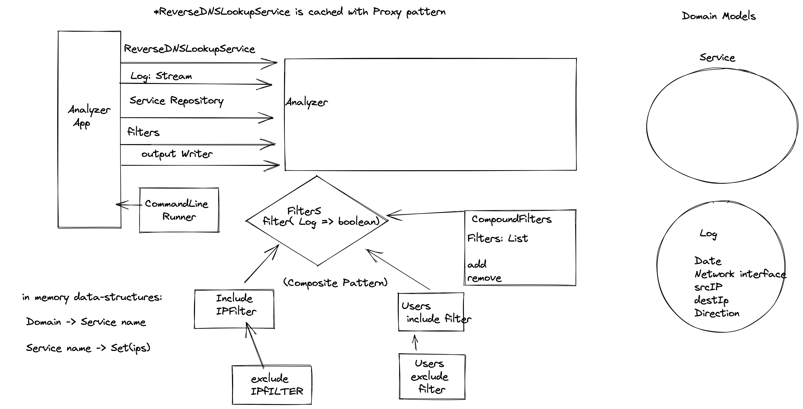

# Interview assignment for Wiz

Had 4 total hours (1 hour to talk to interviewer about the design and 3 to code everything).
Did not make it on time to deliver everything, focused on the design and make it SOLID as possible rather than focus on the how to parse the firewall log, perhaps that was my mistake.
Anyway, this is the design:

used the Composite pattern, and Proxy Pattern , to make the solution easy to use and maintain.